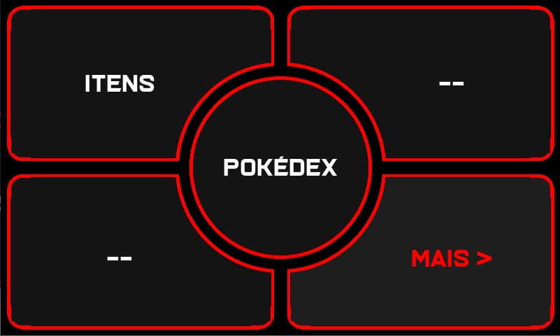
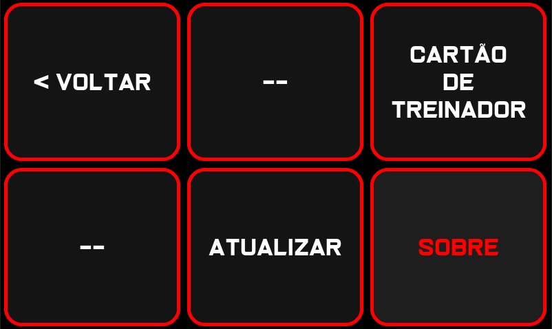
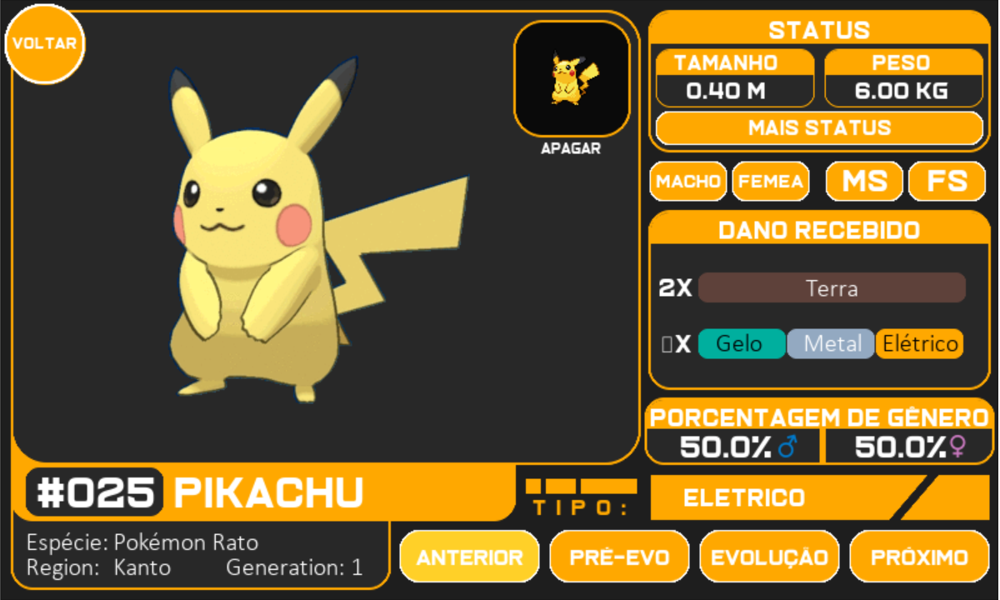

##PyDex

Pokédex para Raspberry Pi
(Problemas de desempenho na Raspberry Pi 3,
Aguardando testes na Raspberry 4
Em PC fluindo perfeitamente)

## Menu Principal

## Mais

## Menu Pokemon

## Protótipo 

Projeto pausado por falta de equipe e suporte para desenvolvimento.

### Informação de Desenvolvimento
- Linguagem: Python
- Versão: Python 3
- Bibliotecas e frameworks: PyGame, SQLite, PokePy

## Instagram
https://www.instagram.com/pydex.py/

## Email
lucascostabustamante@gmail.com